# Jakarta Todo List

A full-stack Java web application (Jakarta EE) for managing personal todos and categories. This README documents the project structure, architecture, how to build and run the app (locally and via Docker), configuration, troubleshooting tips, and a detailed "Screens" section describing every UI screen and where to find its template so you can capture screenshots.

---

## Table of Contents

- Project Overview
- Architecture & Modules
- Build & Run
  - Local (Maven + Tomcat)
  - Docker / docker-compose
- Configuration & Environment
- Database
- Hibernate & Mappings
- Key Features
- Endpoints & Routes
- Screens (UI) — files & descriptions (placeholders for screenshots)
- Troubleshooting & Known Issues
- Development notes & tips
- Contributing
- License

---

## Project Overview

Jakarta Todo List is a multi-module Jakarta EE application that provides user authentication, categories and todos management, and a responsive server-rendered UI using JSPs. It uses Hibernate (XML mappings), PostgreSQL (default for development), and supports an Azure SQL Server configuration for production.

This repository contains the web module with JSP views, EJB/logic modules, and configuration for Docker to run a Postgres database and the app in a container.

---

## Architecture & Modules

Top-level structure (relevant folders):

- `JakartaTodoList-web/` — main web application module (JSPs, Servlets, Services, Repositories, Data models, Hibernate XML mappings).
- `JakartaTodoList-ejb/` or other modules — (if present) shared services or enterprise artifacts.
- `docker/` — initialization SQL files used by the Postgres container.
- `pom.xml` (root) — aggregator pom (builds the EAR/WAR as configured).

Key technologies:

- Jakarta EE (Servlets, JSP)
- Hibernate ORM (XML mappings in `src/main/resources/mappings/*.hbm.xml`)
- PostgreSQL (development), optional Azure SQL Server (production)
- Maven for build
- Docker / docker-compose for easy local environment

---

## Build & Run

### Prerequisites

- Java 11 (project configured with source/target 11)
- Maven 3.6+
- Docker & docker-compose (recommended for local DB + app container)

### Local (Maven + Tomcat)

1. Build the project (from repository root):

```powershell
mvn -DskipTests package
```

2. Deploy the generated WAR (`JakartaTodoList-web/target/JakartaTodoList-web-1.0-SNAPSHOT.war`) to your Tomcat `webapps/` directory and restart Tomcat.

3. Open the app in your browser (default context path depends on your deploy setup, commonly `http://localhost:8080/`)

### Docker (recommended)

A `docker-compose.yml` is included and sets up Postgres + the app image.

From project root:

```powershell
docker-compose build --no-cache
docker-compose up -d
docker-compose logs -f todo-app
```

The app will be available on `http://localhost:8080/` (see docker-compose for port mapping). The Postgres container is initialized with SQL in `docker/init-db/`.

---

## Configuration & Environment

The app reads DB configuration from environment variables in `Utils/HiberneteUtil`:

- `DB_TYPE` (default: `postgres`) — set to `sqlserver` for Azure SQL Server
- `DB_HOST`, `DB_PORT`, `DB_NAME`, `DB_USER`, `DB_PASSWORD`

Other important settings are in the webapp and `pom.xml`.

When running in Docker, these variables are set in `docker-compose.yml`.

---

## Database

- Development: PostgreSQL (container in `docker-compose.yml`).
- Schema init scripts are in `docker/init-db/` (executed by the Postgres image on first run).

Tables: `users`, `categories`, `todos` (see SQL in `docker/init-db/01-init.sql` and resources/sql for schema definition).

Foreign keys: `todos.user_id -> users.id`, `todos.category_id -> categories.id` (category may be nullable).

---

## Hibernate & Mappings

This project uses XML mappings in `src/main/resources/mappings/`:

- `User.hbm.xml`
- `Category.hbm.xml`
- `Todo.hbm.xml`

Notes:
- `Todo.dueDate` is mapped to Hibernate's `LocalDateType` to support `java.time.LocalDate`.
- Status field in `Todo` is stored as a `String` and the Java getters/setters expose a `TodoStatus` enum; `status` property mapping uses field access.

If you change mapping files, rebuild and redeploy the WAR so changes are picked from the classpath.

---

## Key Features

- User authentication (login/register)
- Create, edit, delete Categories
- Create, edit, delete Todos
- Todos can optionally belong to a Category
- Overdue auto-marking job (service method marks overdue todos)
- Server-rendered JSPs, structured components (header/footer, todo item, etc.)

---

## Endpoints & Routes

Routes follow the `Paths` and `Route` enumerations. Example routes (logical):

- `GET /todos` — List todos
- `GET /todos/create` — Show create form
- `POST /todos/create` — Create todo
- `GET /todos/{id}` — View a single todo
- `POST /todos/{id}/update` — Update todo
- `POST /todos/{id}/delete` — Delete todo

- `GET /categories` — List categories
- `GET /categories/create` — Create category form
- `POST /categories/create` — Create category
- `GET /categories/{id}` — View a category and its todos

Authentication routes are available under the auth base path (see `Servelts/AuthServlet` & `Paths.Auth`).

---

## Screens (UI) — gallery + details

Below is a visual gallery of the application's screens (top) followed by a detailed section describing each screen and where to find its JSP template.

Gallery (click any thumbnail to view full image):

<div style="display:flex;flex-wrap:wrap;gap:12px">
  <a href="docs/shots/home.png">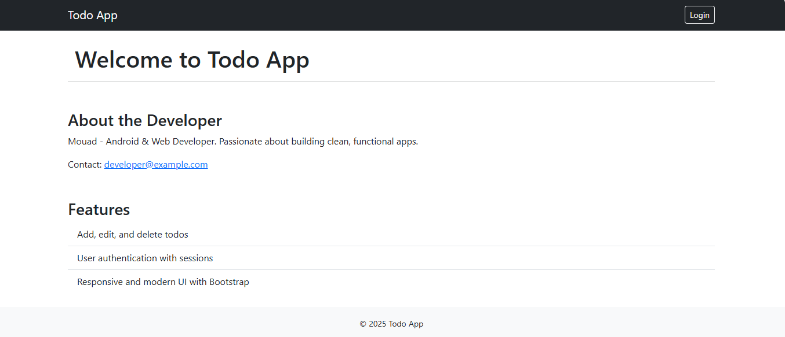</a>
  <a href="docs/shots/todos_list.png">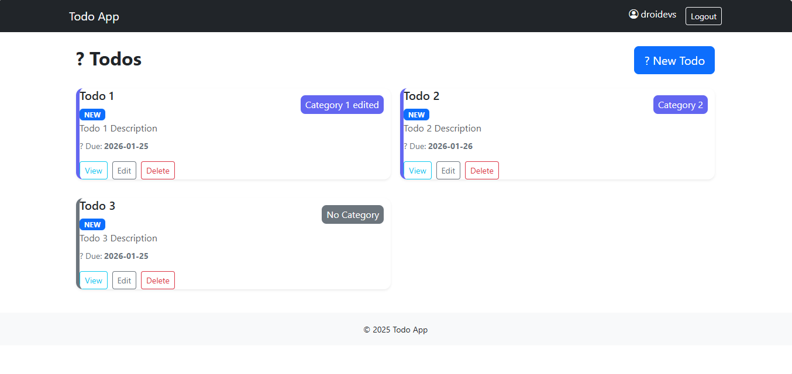</a>
  <a href="docs/shots/todos_list_empty.png">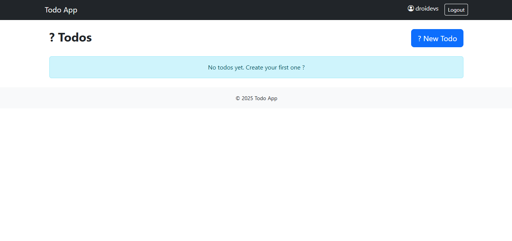</a>
  <a href="docs/shots/create_todo_form_top.png">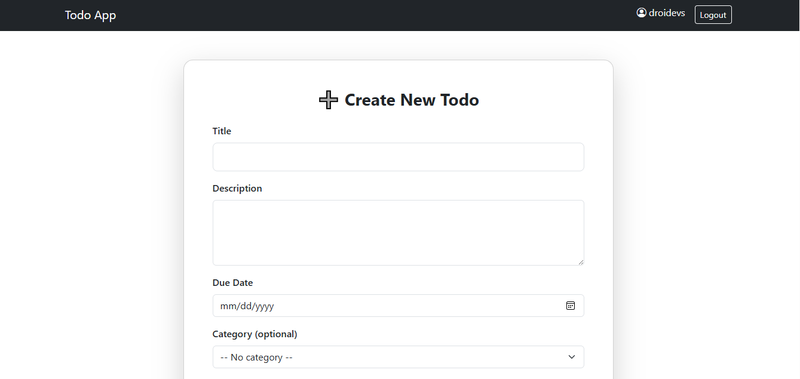</a>
  <a href="docs/shots/create_todo_form_bottom.png">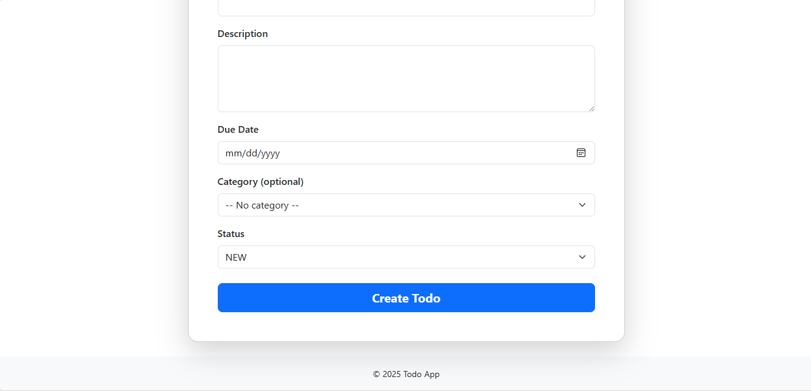</a>
  <a href="docs/shots/todo_edit_top.png">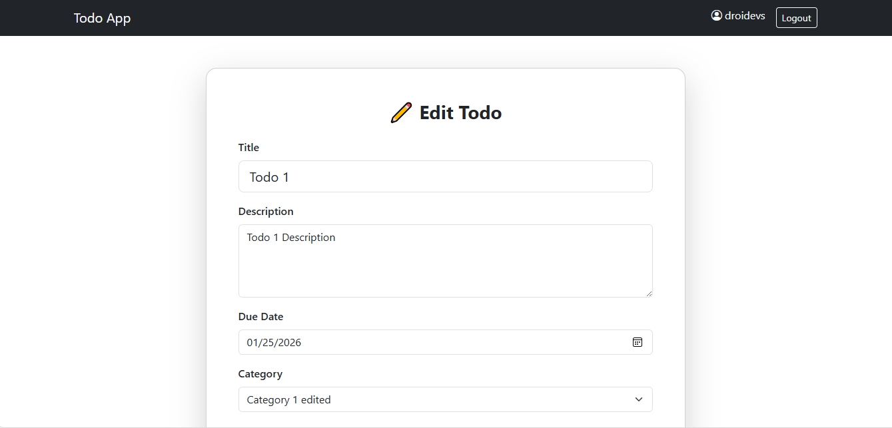</a>
  <a href="docs/shots/todo_edit_bottom.png">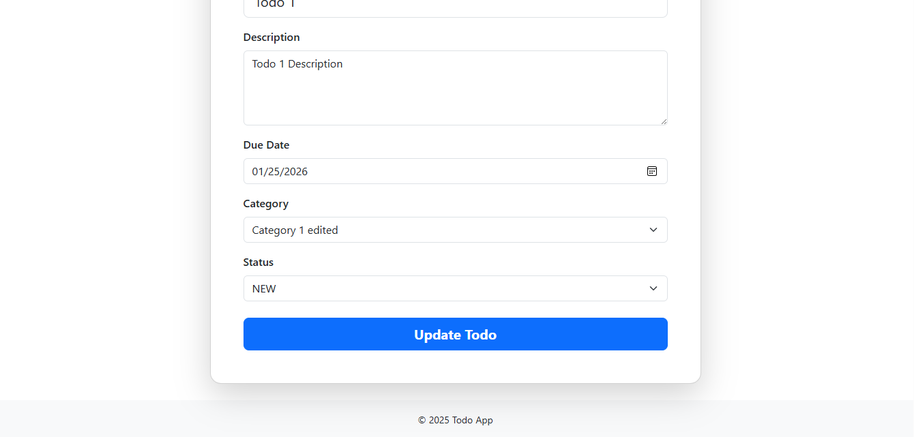</a>
  <a href="docs/shots/view_todo.png">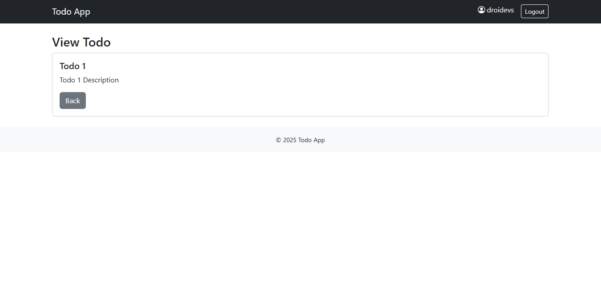</a>
  <a href="docs/shots/categories_list.png">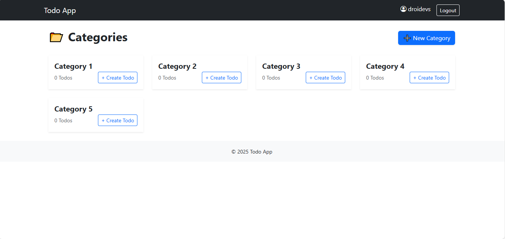</a>
  <a href="docs/shots/categories_list_empty.png">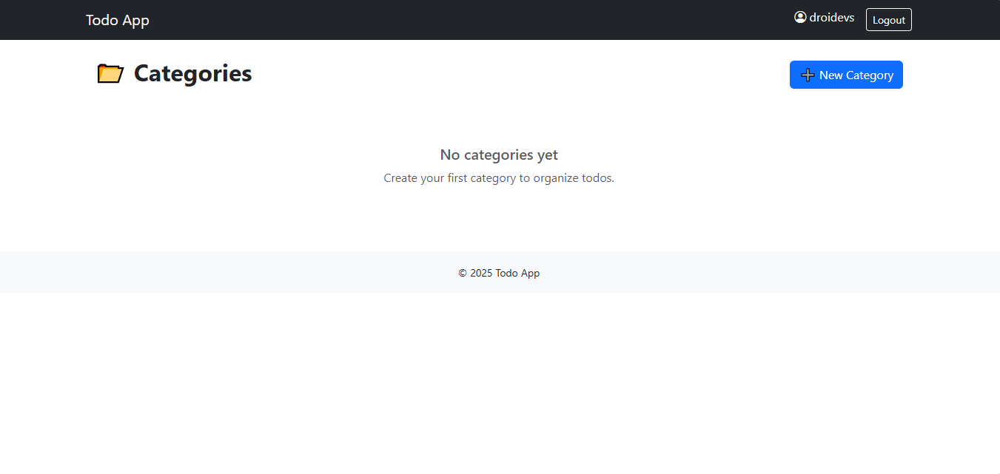</a>
  <a href="docs/shots/category_view.png">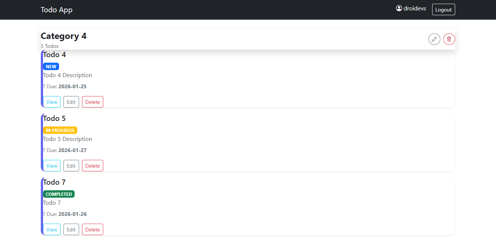</a>
  <a href="docs/shots/category_view_empty.png">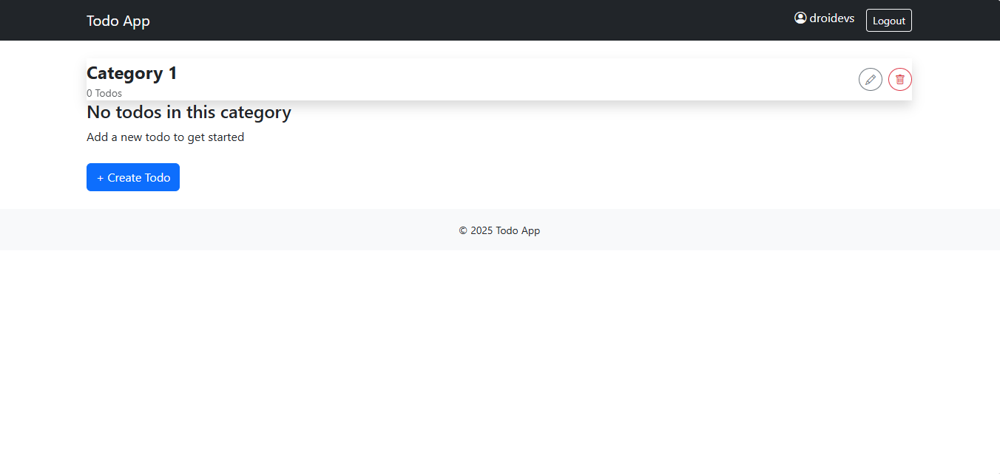</a>
  <a href="docs/shots/category_create.png">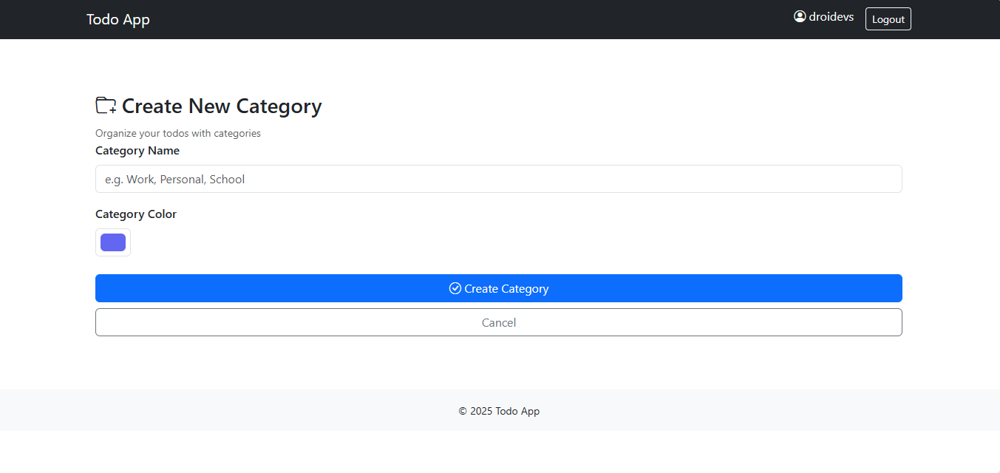</a>
  <a href="docs/shots/edit_category.png">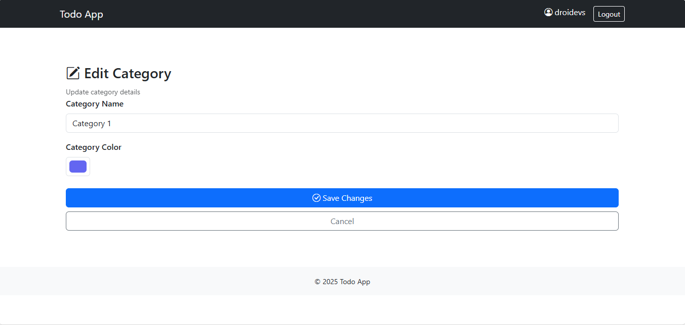</a>
  <a href="docs/shots/login.png">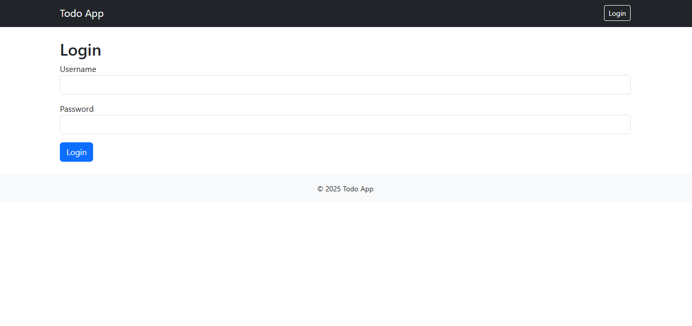</a>
  <a href="docs/shots/register.png">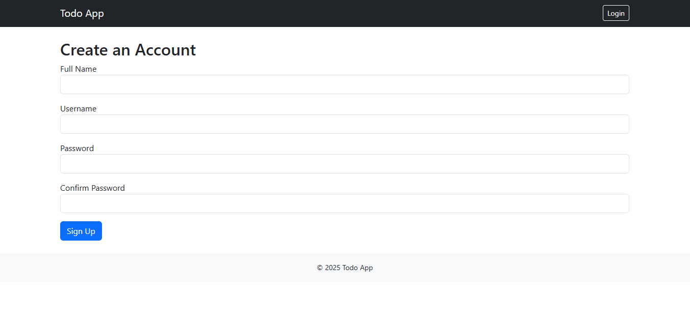</a>
</div>

---

Detailed screen descriptions

1) Home / Dashboard
- Screenshot: `docs/shots/home.png`
- JSP: `src/main/webapp/index.html` (or home controller/view if present)
- Notes: entry page; shows a quick summary and navigation.

2) Todos list (full)
- Screenshot: `docs/shots/todos_list.png`
- JSP: `WEB-INF/views/todos.jsp`
- Notes: Two-column grid of todo cards, category badge, status and actions (View/Edit/Delete).

3) Todos list (empty)
- Screenshot: `docs/shots/todos_list_empty.png`
- JSP: `WEB-INF/views/todos.jsp`
- Notes: Empty state prompting user to create a todo.

4) Create Todo — top (form header)
- Screenshot: `docs/shots/create_todo_form_top.png`
- JSP: `WEB-INF/views/todo_form.jsp` (create mode)
- Notes: Title, Description and initial fields shown at top of form.

5) Create Todo — bottom (form actions)
- Screenshot: `docs/shots/create_todo_form_bottom.png`
- JSP: `WEB-INF/views/todo_form.jsp` (create mode)
- Notes: Status select and Create button shown at bottom of form.

6) Edit Todo — top
- Screenshot: `docs/shots/todo_edit_top.png`
- JSP: `WEB-INF/views/todo_form.jsp` (edit mode)
- Notes: Similar to create form but pre-filled; category select visible.

7) Edit Todo — bottom
- Screenshot: `docs/shots/todo_edit_bottom.png`
- JSP: `WEB-INF/views/todo_form.jsp` (edit mode)
- Notes: Action buttons and validation messages (if any).

8) View Todo (single)
- Screenshot: `docs/shots/view_todo.png`
- JSP: `WEB-INF/views/todo_view.jsp`
- Notes: Read-only view showing todo details and a Back button.

9) Categories list (full)
- Screenshot: `docs/shots/categories_list.png`
- JSP: `WEB-INF/views/categories.jsp`
- Notes: Grid of category cards with colors, names, todo counts and '+ Create Todo' buttons.

10) Categories list (empty)
- Screenshot: `docs/shots/categories_list_empty.png`
- JSP: `WEB-INF/views/categories.jsp`
- Notes: Empty state for categories.

11) Category view (full)
- Screenshot: `docs/shots/category_view.png`
- JSP: `WEB-INF/views/category_view.jsp`
- Notes: Header with category name and its todos (todo cards suppress category badge in this view).

12) Category view (empty)
- Screenshot: `docs/shots/category_view_empty.png`
- JSP: `WEB-INF/views/category_view.jsp`
- Notes: Empty state prompting to create a todo in this category.

13) Create Category
- Screenshot: `docs/shots/category_create.png`
- JSP: `WEB-INF/views/category_form.jsp`
- Notes: Name, Color and Description fields.

14) Edit Category
- Screenshot: `docs/shots/edit_category.png`
- JSP: `WEB-INF/views/category_form.jsp` (edit mode)
- Notes: Pre-filled form to update or delete category.

15) Authentication — Login
- Screenshot: `docs/shots/login.png`
- JSP: `WEB-INF/views/login.jsp`
- Notes: Username/password form.

16) Authentication — Register
- Screenshot: `docs/shots/register.png`
- JSP: `WEB-INF/views/signup.jsp`
- Notes: Registration form with username, full name, password fields.

---

Instructions to replace or update screenshots

- If you want different filenames or to add higher-resolution images, place them into `docs/shots/` and use the same name as referenced above, or update the paths in this README to match your filenames.
- To embed alternative formats (PNG/JPG), update the links in the gallery and the detailed entries accordingly.

---

## Troubleshooting & Known Issues

- `ClassCastException: java.time.LocalDate cannot be cast to java.util.Date`
  - Cause: Hibernate type mismatch when mapping `LocalDate` to an old Date descriptor.
  - Fix: `Todo.hbm.xml` maps `dueDate` to `org.hibernate.type.LocalDateType` (supported for Hibernate 6.x). Rebuild & redeploy after changes.

- `org.hibernate.LazyInitializationException: could not initialize proxy [Data.Category#1] - no Session`
  - Cause: a lazy-associated entity (e.g., `Category`) is accessed in JSP after the session was closed.
  - Fix: modify repository queries to `JOIN FETCH` associations used in views (we updated `TodoRepositoryHibernete.findByUserId`), or load required associations in the service before returning entities to the view.

- If runs fail because of DB connection errors:
  - Check environment variables for DB host/port/credentials and ensure Postgres container is up and healthy.
  - In Docker: `docker-compose logs postgres` and `docker-compose ps` to check container status.

---

## Development notes & tips

- Prefer editing server-side Java code and JSPs in your IDE, then rebuild the WAR.
- For rapid iteration you can run Tomcat locally and replace the exploded webapp files, but restart Tomcat to ensure Hibernate picks up mapping changes.
- Use the `Utils/HiberneteUtil` to inspect which DB the app connects to (it prints the JDBC URL at startup).

---

## Contributing

If you plan to extend the app:

- Follow the existing package layout: `Services`, `Repositories`, `Mappers`, `Models`, `Data`.
- Add tests where possible (module currently has limited tests).
- Keep XML mappings consistent with class fields and prefer explicit Hibernate types for `java.time` classes.

---

## License

This project is provided under MIT.
